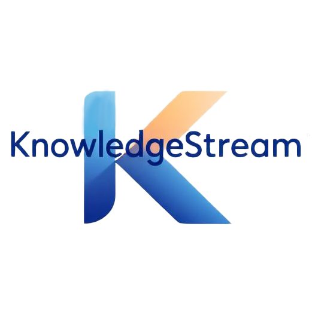

# KnowledgeStream

## 介绍
 **KnowledgeStream** 是由 **RookieCoven** 自主研发的一款全新在线学习应用。平台发生在一个被称作「知识空间」的数字领域，在这里，被认证的导师将被授予「智慧火种」，分享知识与技能。你将扮演一位名为「学习者」的探索角色，在自由的学习中邂逅风格各异、经验丰富的导师们，观看他们的教学视频，和他们一起攻克难关，掌握核心知识——同时，逐步发掘「知识」的真谛。

 ## 功能

*   **在线课程**: 学习者可以浏览和观看由认证导师发布的视频课程。
*   **互动评论**: 学习者可以在课程下发表评论，与导师和其他学习者交流。
*   **通知系统**: 及时接收课程更新、评论回复等通知。
*   **用户管理**: 支持学习者和导师注册、登录和个人信息管理。
*   **管理后台**: 提供管理界面，用于管理用户、课程、评论等。
*   **数据统计**: 查看平台相关的统计数据。

## 许可证

本项目采用 [GNU General Public License v3.0](./LICENSE) 许可证。
